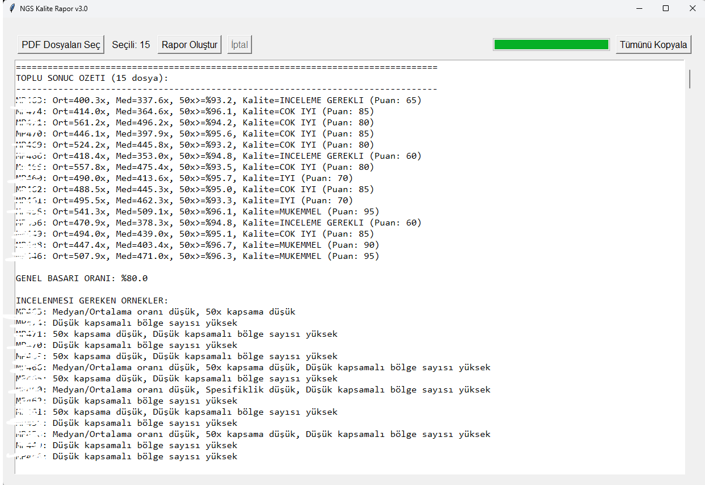

# Coverage_Report - Toplu NGS Kalite Değerlendirme Aracı

**Coverage_Report**, **NGS (Next Generation Sequencing)** verileri için oluşturulan **PDF coverage dosyalarını** toplu halde analiz ederek, her dosya (hasta veya örnek) için **kapsama kalitesini** hızlıca özetleyen bir **Tkinter** uygulamasıdır. 

Kapsama raporlarından (coverage report) elde edilen veriler, **ilk aşamada** (VCF, BAM, BAI dosyaları üretilmeden önce) laboratuvar ya da analiz ekibine kaliteye dair **ön bilgi** verir. Böylece zaman kaybetmeden, örneklerin yenilenmesi veya detaylı inceleme gerekliliği gibi kritik kararlar hızlıca alınabilir.

## Ana Özellikler

- **Çoklu PDF Seçimi**: Tek seferde birden fazla coverage raporu seçerek toplu analiz gerçekleştirebilirsiniz.
- **Ağırlıklı Puanlama**: Ortalama kapsama, medyan/ortalama oranı, 50x üstü kapsama, spesifiklik, düşük kapsamalı bölge sayısı gibi metriklere göre 100 üzerinden puanlama yapılır.
- **Kalite Seviyesi**: Toplam puana göre “**MÜKEMMEL**”, “**ÇOK İYİ**”, “**İYİ**”, “**İNCELEME GEREKLİ**” veya “**TEKRAR EDİLMELİ**” gibi bir kalite seviyesi atanır.
- **Toplu Özet**: Seçilen tüm PDF’lerin temel metriklerini ve kalite skorlarını bir arada gösteren kısa bir özet sunulur.
- **Detaylı Raporlama**: Her vaka/örnek için ortalama- medyan kapsama, %50x oranı, düşük kapsamalı bölge sayısı gibi detaylar listelenir. Otomatik olarak tespit edilen olası sorunlar (ör. “Medyan/Ortalama oranı düşük”, “Spesifiklik düşük”) belirtilir.

## Ekran Görüntüsü

Örnek bir analiz sonucunda uygulama ekranı şu şekilde görünür:



> **Not:** Burada ekrana yansıyan veriler, gerçekte PDF’lerden çekilmesi gereken bilgilerin **rastgele (dummy) üretilmiş** halidir. Gerçek kullanımda `parse_coverage_data` fonksiyonunu kendi PDF verinize uyarlamanız gerekecektir.

## Örnek Çıktı

Aşağıdaki **örnek çıktıda**, uygulama tarafından 5 farklı PDF dosyası analiz ediliyor. Her bir “vaka_XX” için:
- Ortalama kapsama (Ort=…)
- Medyan kapsama (Med=…)
- 50x üzeri kapsama oranı (ör. %95.2)
- Toplam puan ve Kalite seviyesi (ör. “İYİ”, “ÇOK İYİ” vb.)

### Toplu Sonuç Özeti

```
================================================================================
TOPLU SONUC OZETI (5 dosya):
--------------------------------------------------------------------------------
vaka_01: Ort=422.3x, Med=380.1x, 50x>=%95.2, Kalite=COK IYI (Puan: 80)
vaka_02: Ort=595.4x, Med=523.8x, 50x>=%94.5, Kalite=IYI (Puan: 70)
vaka_03: Ort=483.2x, Med=401.6x, 50x>=%93.9, Kalite=INCELEME GEREKLI (Puan: 65)
vaka_04: Ort=560.5x, Med=519.3x, 50x>=%96.2, Kalite=MUKEMMEL (Puan: 95)
vaka_05: Ort=405.7x, Med=342.7x, 50x>=%92.1, Kalite=IYI (Puan: 70)

GENEL BASARI ORANI: %80.0

INCELENMESI GEREKEN ORNEKLER:
vaka_01: Düşük kapsamalı bölge sayısı yüksek
vaka_02: Medyan/Ortalama oranı düşük
vaka_03: Spesifiklik düşük, Düşük kapsamalı bölge sayısı yüksek
...
================================================================================
```

### Detaylı Rapor

Her bir “vaka_XX” için şu şekilde detay verilir:

```
================================================================================
                    NGS KALITE RAPORU - vaka_01
================================================================================

GENEL KALITE DEGERLENDIRMESI:
---------------------------
Kalite Seviyesi: COK IYI
Toplam Puan: 80/100

METRIK PUANLARI:
--------------
Ortalama Kapsama: 30/30
Medyan/Ortalama Oranı: 20/20
50x Kapsama: 15/30
Spesifiklik: 10/10
Düşük Kapsamalı Bölgeler: 5/10

DETAYLI METRIKLER:
----------------
Ortalama Kapsama: 422.3x
Medyan Kapsama: 380.1x
Medyan/Ortalama Oranı: 0.90
50x Üzeri Kapsama: %95.2
Minimum Kapsama: 33.5x
Maksimum Kapsama: 1005.5x
...

TESPIT EDILEN SORUNLAR:
---------------------
• Düşük kapsamalı bölge sayısı yüksek
================================================================================
```

## Kurulum ve Kullanım

1. **Depoyu Klonlayın veya İndirin**  
   ```bash
   git clone https://github.com/kullanici/coverage_report.git
   cd coverage_report
   ```

2. **Gerekli Paketler**  
   Python 3.7+ tavsiye edilir. Aşağıdaki kütüphaneler gerekebilir:
   ```bash
   pip install tkinter
   pip install PyPDF2 pdfplumber
   ```
   > Not: Bazı Linux sistemlerde `python3-tk` paketini ayrıca kurmak gerekebilir.

3. **Uygulamayı Çalıştırma**  
   ```bash
   python coverage_report.py
   ```
   veya projenizin yapısına göre  
   ```bash
   python -m coverage_report
   ```
   gibi bir komutla çalıştırılabilir.

4. **Nasıl Kullanılır?**  
   - Uygulama açıldığında “**PDF Dosyaları Seç**” butonu ile istediğiniz **birden çok PDF**’i seçebilirsiniz.  
   - “**Rapor Oluştur**” butonuna tıklayın. Seçili PDF’ler tek tek parse edilerek ekrana **özet** ve ardından **detaylı** raporlar yazılacaktır.  
   - “**Tümünü Kopyala**” butonu ile ekranda oluşan rapor çıktısını panonuza kopyalayabilirsiniz.

> **Önemli**: Şu anda PDF’den gerçek veri çekme yerine `parse_coverage_data` fonksiyonu _dummy_ (rastgele) değerler üretmektedir. Projenizi gerçek kullanım için düzenlemek isterseniz, PDF içeriğini okumak ve ilgili metrikleri çıkartmak adına (ör. `pdfplumber` veya `PyPDF2` ile regex/string arama) kendi kodlarınızı eklemeniz gerekir.

## Proje Yapısı

```text
.
├── coverage_report.py    # Ana uygulama ve TK arayüz kodu
├── screen.png            # Örnek ekran görüntüsü
├── README.md             # Açıklayıcı doküman
└── requirements.txt      # (Opsiyonel) Gerekli paketler
```

## Katkıda Bulunma

1. **Pull Request** açarak yeni özellikler ekleyebilir veya hataları düzeltebilirsiniz.  
2. **Issues** oluşturup iyileştirilmesini istediğiniz konuları ya da hataları bildirebilirsiniz.

## Lisans

Bu proje [MIT Lisansı](https://opensource.org/licenses/MIT) altında sunulmaktadır. Detaylar için [LICENSE](LICENSE) dosyasına bakabilirsiniz.

---

**Teşekkürler!**  
İyi analizler dileriz. Feedback ve katkılarınız için şimdiden teşekkürler.
